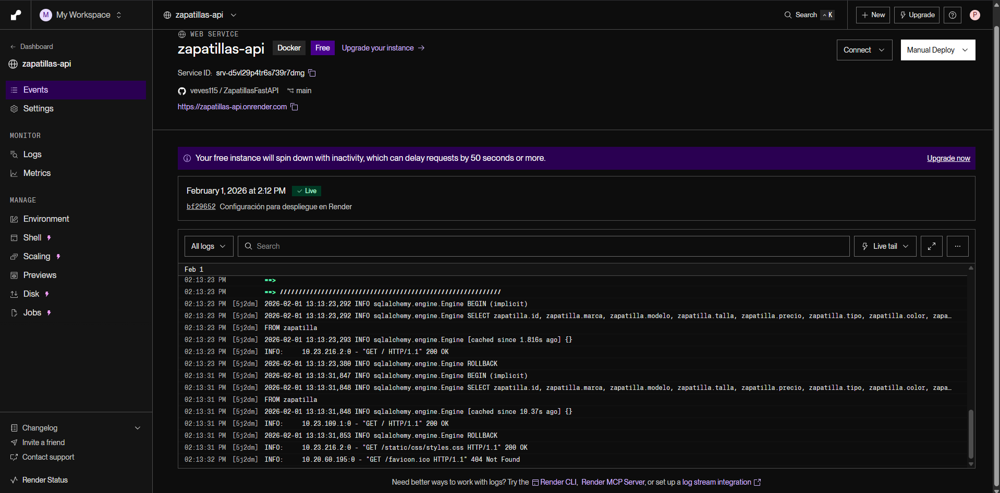
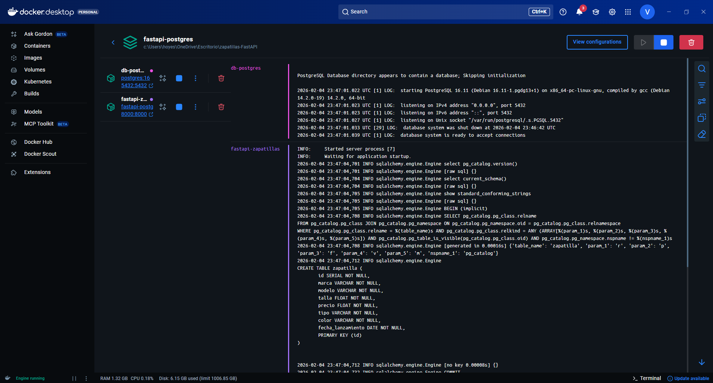

# Despliegue en Render - Zapatillas API

## Repositorio GitHub

| Rama | Base de datos | URL |
|------|---------------|-----|
| `main` | PostgreSQL | [https://github.com/veves115/ZapatillasFastAPI/tree/main](https://github.com/veves115/ZapatillasFastAPI/tree/main) |
| `mysql-version` | MySQL | [https://github.com/veves115/ZapatillasFastAPI/tree/mysql-version](https://github.com/veves115/ZapatillasFastAPI/tree/mysql-version) |

> **Nota:** Los directorios `__pycache__/` y `venv/` estan excluidos del repositorio mediante `.gitignore`.

## Enlace de la aplicación desplegada

**URL**: [https://zapatillas-api.onrender.com](https://zapatillas-api.onrender.com)

## Capturas de prueba del despliegue

### Despliegue en Render



## Cambios realizados para el despliegue

### 1. Dockerfile

Se configuró el Dockerfile para ejecutar la aplicación con Uvicorn, usando la variable de entorno `PORT` que Render asigna dinámicamente:

```dockerfile
FROM python:3.11-slim

WORKDIR /app

COPY requirements.txt .
RUN pip install -r requirements.txt

COPY . .
RUN rm -f .env

CMD ["sh", "-c", "uvicorn src.main:app --host 0.0.0.0 --port ${PORT:-8000}"]
```

**Notas importantes:**
- Se usa `python:3.11-slim` para reducir el tamaño de la imagen
- Se elimina el archivo `.env` para evitar conflictos con las variables de entorno de Render
- Se usa `${PORT:-8000}` para usar el puerto asignado por Render o 8000 por defecto

### 2. Configuración de Base de Datos (src/data/db.py)

La conexión a la base de datos lee las credenciales desde variables de entorno:

```python
db_user: str = os.getenv("DB_USER", "pablo")
db_password: str = os.getenv("DB_PASSWORD", "1234")
db_host: str = os.getenv("DB_HOST", "zapatillas-db")
db_port: str = os.getenv("DB_PORT", "5432")
db_name: str = os.getenv("DB_NAME", "zapatillas-db")

DATABASE_URL = f"postgresql+psycopg2://{db_user}:{db_password}@{db_host}:{db_port}/{db_name}"
```

### 3. requirements.txt

Dependencias necesarias para el despliegue:

```
fastapi
uvicorn
sqlmodel
psycopg2-binary
jinja2
python-multipart
python-dotenv
```
## Proceso de despliegue manual

### Paso 1: Crear la Base de Datos PostgreSQL

1. Iniciar sesión en [render.com](https://render.com)
2. Ir a **New** → **PostgreSQL**
3. Configurar:
   - **Name**: `zapatillas-db`
   - **Database**: `zapatillas_db`
   - **User**: `zapatillas_user`
   - **Region**: Elegir la más cercana
   - **Plan**: **Free**
4. Click en **Create Database**
5. Esperar a que se cree y copiar los datos de conexión desde la pestaña **Info**:
   - Hostname
   - Port
   - Database
   - Username
   - Password

### Paso 2: Crear el Web Service

1. Ir a **New** → **Web Service**
2. Conectar el repositorio de GitHub/GitLab
3. Configurar:
   - **Name**: `zapatillas-api`
   - **Region**: La misma que la base de datos
   - **Branch**: `main`
   - **Runtime**: **Docker**
   - **Plan**: **Free**

4. Añadir las **Environment Variables**:

   | Variable | Valor |
   |----------|-------|
   | `DB_USER` | (Username de la base de datos) |
   | `DB_PASSWORD` | (Password de la base de datos) |
   | `DB_HOST` | (Hostname de la base de datos) |
   | `DB_PORT` | `5432` |
   | `DB_NAME` | (Database name) |

---

## Diferencias entre ramas: PostgreSQL vs MySQL

Este proyecto cuenta con dos ramas principales que utilizan diferentes bases de datos:

| Aspecto | Rama `main` (PostgreSQL) | Rama `mysql-version` (MySQL) |
|---------|--------------------------|------------------------------|
| **Base de datos** | PostgreSQL 16 | MySQL 8 |
| **Driver Python** | `psycopg2-binary` | `pymysql` + `cryptography` |
| **Puerto por defecto** | 5432 | 3306 |
| **Cadena de conexion** | `postgresql+psycopg2://` | `mysql+pymysql://` |
| **Docker Compose** | `docker-compose-postgres.yml` | `docker-compose.yml` |

### Diferencias en el codigo fuente

#### 1. Archivo `src/data/db.py`

**Rama main (PostgreSQL):**
```python
db_port: str = os.getenv("DB_PORT", "5432")
DATABASE_URL = f"postgresql+psycopg2://{db_user}:{db_password}@{db_host}:{db_port}/{db_name}"
```

**Rama mysql-version (MySQL):**
```python
db_port: str = os.getenv("DB_PORT", "3306")
DATABASE_URL = f"mysql+pymysql://{db_user}:{db_password}@{db_host}:{db_port}/{db_name}"
```

#### 2. Archivo `requirements.txt`

**Rama main (PostgreSQL):**
```
fastapi
uvicorn
sqlmodel
psycopg2-binary
jinja2
python-multipart
python-dotenv
```

**Rama mysql-version (MySQL):**
```
fastapi
uvicorn
sqlmodel
pymysql
cryptography
jinja2
python-multipart
python-dotenv
```

> **Nota:** La rama MySQL requiere el paquete `cryptography` adicional porque MySQL 8 utiliza el metodo de autenticacion `caching_sha2_password` por defecto.

### Capturas de funcionamiento

#### PostgreSQL funcionando con la aplicacion


#### MySQL funcionando con la aplicacion


---

## Por que elegir PostgreSQL con psycopg2-binary

### Ventajas de PostgreSQL

1. **Soporte nativo en plataformas cloud**: Render, Heroku, Railway y la mayoria de plataformas PaaS ofrecen PostgreSQL gratuito integrado, lo que simplifica el despliegue.

2. **Rendimiento superior en consultas complejas**: PostgreSQL tiene un optimizador de consultas mas avanzado, ideal para aplicaciones que crecen en complejidad.

3. **Tipos de datos avanzados**: Soporte nativo para JSON, arrays, y tipos personalizados que facilitan el modelado de datos.

4. **ACID completo**: Cumplimiento estricto de las propiedades ACID (Atomicidad, Consistencia, Aislamiento, Durabilidad).

### Ventajas de psycopg2-binary

1. **Driver mas maduro y estable**: Es el adaptador de PostgreSQL mas utilizado en Python, con mas de 20 años de desarrollo.

2. **Rendimiento optimizado**: Implementado en C, ofrece el mejor rendimiento para operaciones con PostgreSQL.

3. **Compatibilidad total con SQLAlchemy/SQLModel**: Funciona perfectamente con el ORM utilizado en este proyecto.

4. **Instalacion sencilla**: La version `binary` incluye las librerias de PostgreSQL precompiladas, evitando problemas de dependencias del sistema.

5. **Sin dependencias adicionales**: A diferencia de MySQL con `pymysql`, no requiere paquetes adicionales como `cryptography`.


